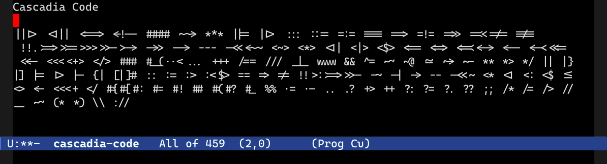

================================
 Typographic Ligatures in Emacs
================================

This package maps ordinary graphemes (characters) to fancy ligatures,
if both your version of Emacs and the font supports it.

With this package you can control where Emacs must display ligatures.
That is useful if you only want a subset of the ligatures in certain
major modes, for instance, or if you want to ensure that some modes
have no ligatures at all.

If you know what you're doing, you can skip to the end for an example
that works with ``Cascadia Code`` (and most probably other fonts, too).

Compatibility and Version Requirements
======================================

Support for this feature is new. You must meet a number of requirements to ensure the package works correctly:

1. You must use Emacs 28 or later, or backport a fix to Emacs 27.x;

   You can check by typing ``M-x emacs-version``.

   **NOTE**: There are critical issues in Emacs 27.1 and 27.2. 
   Ideally, if at all possible, you should attempt to use a build of
   Emacs that includes this fix. See below for details.

2. Your Emacs must be built with Harfbuzz enabled -- this is the default as of Emacs 27.1, but obscure platforms may not support it;

   You can check by typing ``C-h v system-configuration-features``. Search for the word ``HARFBUZZ``.

3. You must have a font that supports the particular typographical ligature you wish to display. Emacs should skip the ones it does not recognize, however;

   Common programming fonts include `Cascadia Code
   <https://github.com/microsoft/cascadia-code>`__, `Fira Code
   <https://github.com/tonsky/FiraCode>`__, `Iosevka
   <https://github.com/be5invis/Iosevka>`__, and `JetBrains Mono
   <https://github.com/JetBrains/JetBrainsMono>`__.
   
   For variable width fonts, the world is your oyster.

4. Ideally, your Emacs is built with Cairo support. Without it, you may experience issues;

   You can check by typing ``C-h v cairo-version-string``. If you cannot
   find it, you probably don't have it built: you can double check by
   looking at ``system-configuration-features`` -- see above.

   a. Older versions of Cairo apparently have some issues.
      ``cairo-version-string`` should say "1.16.0" or later.

      See above. It may work perfectly fine with a lower version, however.

Crash issues in Emacs 27.1 and Emacs 27.2
-----------------------------------------

If you are using a release build of Emacs 27.x then you may `experience hangs or crashes <https://github.com/mickeynp/ligature.el/issues/10>`__ with the following message::

  Attempt to shape unibyte text

The source of the fix is `this commit <http://git.savannah.gnu.org/cgit/emacs.git/commit/?id=fe903c5ab7354b97f80ecf1b01ca3ff1027be446>`__, but it did not make it into Emacs 27.1 or 27.2, unfortunately.

However, if you built Emacs off the ``master`` branch then you most certainly have the fix already.

How does it work?
=================

Unlike almost all text editors that support ligatures, you are free to choose which ligatures you want and which modes they apply to. That is rather important as you may only want some ligatures in certain modes, and perhaps none at all in other modes. With this package you can freely pick and choose.

Quickstart Guide
----------------

You can copy and paste the example snippet near the end. It'll give you basic support for *Cascadia Code*, but many of the ligations are similar across fonts. You will most likely have to amend this sample if you want fancier features.

Adding New Ligations
--------------------

This is very easy to do. You can create ligations with the function ``ligature-set-ligatures``.

You must also enable ``M-x ligature-mode`` in the mode(s) you want it to apply to. The ligations are disabled if you turn off this minor mode, and you can enable it *globally* with ``M-x global-ligature-mode``.

You must have the list of ligations you want Emacs to ligate. For instance, ``==>`` to turn into an arrow, for example. You also need the list of major mode(s) you want it apply to; or, you can tell the ligation engine to apply it everywhere. You can make as many calls to ``ligature-set-ligatures`` as you like.

Here is a very simple example that enables simple HTML ligations for web-related major modes using the *string notation* to create ligations::

  (ligature-set-ligatures '(html-mode nxml-mode web-mode) '("<!--" "-->" "</>" "</" "/>" "://"))

When you evaluate the form the change should take effect immediately in ``html-mode``, ``nxml-mode``, and ``web-mode``. Occasionally, you may have to "reload" the configuration in a major mode. This is usually only required if you are experimenting. Simply toggle ``M-x ligature-mode`` or ``M-x global-ligature-mode``.

You can also supply ``t`` in lieu of a list of major modes. Any ligations registered with ``t`` will have their ligations applied *everywhere* in Emacs.

Complex Compositions
~~~~~~~~~~~~~~~~~~~~

Some fonts support variable-length ligations, such as headings or arrows. The usual *string notation* used above is not always enough. You can build your own regular expressions and the ligation engine will try -- emphasis *try* -- to combine your custom regular expressions with any existing *string notations* that may already exist.

To use the regular expression syntax you can add forms of ``(STR-CHAR . REGEXP)``, like so::

  (ligature-set-ligatures 'markdown-mode '(("=" (rx (+ "=") (? (| ">" "<"))))
                                           ("-" (rx (+ "-")))))

This creates two ligation mappings: one for ligations beginning with ``=`` and the other for ``-``. You must give the starting character of a ligation so Emacs's composition engine knows how to compose the beginning of a ligature. The second part of the form is an ``rx`` macro call that defines the regular expression. In this case it will match any length of ``=`` followed by an optional ``<`` or ``>`` to add arrow support.

Removing or browsing existing compositions
------------------------------------------

If you are experimenting and you want to clear all existing compositions, you can do so with this command::

  (setq ligature-composition-table nil)

You can also view the variable's contents if you want to see how the ligation tool works. You can even edit it manually (see ``Technical Details`` below.)

Technical Details
-----------------

Each buffer you want the ligatures to apply to require a call to ``ligature-generate-ligatures``. That command will check against a table of registered ligatures if the current buffer's major mode has any associated ligatures and, if it does, what they are. The command will check against anything that may be considered a valid parent of your buffer's major mode: for instance, a lot of programming major modes inherit from ``prog-mode``, so assigning ligatures to that major mode is a good way to ensure they work in most programming modes.

To create a ligature mapping you can either update the alist ``ligature-composition-table`` directly or use the helper function ``ligature-set-ligatures``. I recommend you start with the latter helper function and only modify the table if you have complex requirements.

How do I install it?
====================

MELPA support etc. is coming soon, but until then, you can clone the repository and paste one of the example snippets below.

These example snippets enables all ligatures for ``prog-mode`` and any
major mode that derives from that mode; that is usually most
programming-related modes.

You can find more font configurations in the `Wiki <https://github.com/mickeynp/ligature.el/wiki>`__

Example Font Configuration: Cascadia Code
-----------------------------------------

This snippet is designed for the *Cascadia Code* font;
you may find it won't work 100% if you use a different one.

::

  (use-package ligature
    :load-path "path-to-ligature-repo"
    :config
    ;; Enable the "www" ligature in every possible major mode
    (ligature-set-ligatures 't '("www"))
    ;; Enable traditional ligature support in eww-mode, if the
    ;; `variable-pitch' face supports it
    (ligature-set-ligatures 'eww-mode '("ff" "fi" "ffi"))
    ;; Enable all Cascadia Code ligatures in programming modes
    (ligature-set-ligatures 'prog-mode '("|||>" "<|||" "<==>" "<!--" "####" "~~>" "***" "||=" "||>"
                                         ":::" "::=" "=:=" "===" "==>" "=!=" "=>>" "=<<" "=/=" "!=="
                                         "!!." ">=>" ">>=" ">>>" ">>-" ">->" "->>" "-->" "---" "-<<"
                                         "<~~" "<~>" "<*>" "<||" "<|>" "<$>" "<==" "<=>" "<=<" "<->"
                                         "<--" "<-<" "<<=" "<<-" "<<<" "<+>" "</>" "###" "#_(" "..<"
                                         "..." "+++" "/==" "///" "_|_" "www" "&&" "^=" "~~" "~@" "~="
                                         "~>" "~-" "**" "*>" "*/" "||" "|}" "|]" "|=" "|>" "|-" "{|"
                                         "[|" "]#" "::" ":=" ":>" ":<" "$>" "==" "=>" "!=" "!!" ">:"
                                         ">=" ">>" ">-" "-~" "-|" "->" "--" "-<" "<~" "<*" "<|" "<:"
                                         "<$" "<=" "<>" "<-" "<<" "<+" "</" "#{" "#[" "#:" "#=" "#!"
                                         "##" "#(" "#?" "#_" "%%" ".=" ".-" ".." ".?" "+>" "++" "?:"
                                         "?=" "?." "??" ";;" "/*" "/=" "/>" "//" "__" "~~" "(*" "*)"
                                         "\\\\" "://"))
    ;; Enables ligature checks globally in all buffers. You can also do it
    ;; per mode with `ligature-mode'.
    (global-ligature-mode t))

Can I contribute support for more fonts?
========================================

I'm glad you asked. Yes, please. If you want to configure ligatures
for common programming fonts not already listed here, please raise a
PR.
